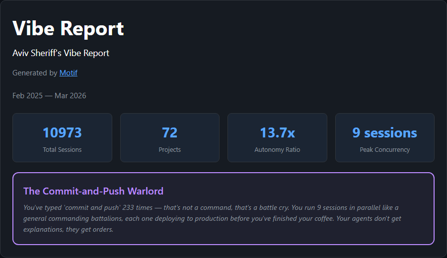
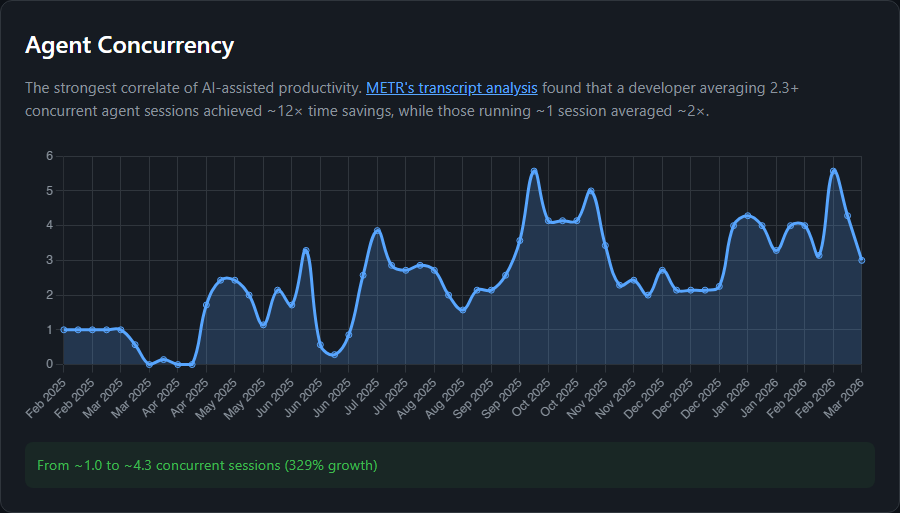
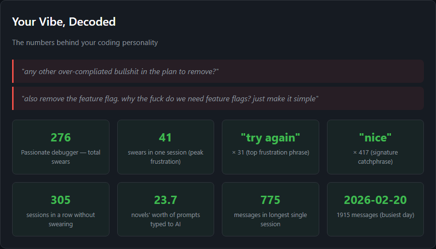

# Process is the new credential

**Motif reads your AI coding conversations and generates your Agentic Coding Assessment.**

[](https://pypi.org/project/motif-cli/)
[](https://opensource.org/licenses/Apache-2.0)
[](https://www.python.org/downloads/)

## ⚡ Live Dashboard — `motif live`

Track your AI output in real-time. Like StarCraft APM, but for vibe coding.


Key metrics shown: **AIPM** (AI tokens per minute), **concurrency** (parallel agents), **per-agent efficiency**. Color-coded thresholds from red (idle) to purple (peak output). Session summary when you stop.

Claude Code support. Cursor and more coming soon.

```bash
motif live                    # Full TUI dashboard
motif live --compact          # Single-line mode
motif live --summary          # Quick summary of current session
```

## 🧩 VS Code Extension — Dashboard Inside Your IDE

Want the dashboard without leaving your editor? The **Motif VS Code extension** brings real-time AIPM and concurrency tracking directly into Cursor's status bar and sidebar.

- **Status bar** — color-coded AIPM indicator always visible while you code
- **Sidebar dashboard** — full session stats without switching windows
- **Session persistence** — personal bests tracked across sessions, same as `motif live`

Install from [Open VSX](https://open-vsx.org/extension/motif/motif) (works in Cursor) or the [VS Code Marketplace](https://marketplace.visualstudio.com/items?itemName=motif.motif).

## 📊 Vibe Report — Your Agentic Coding Assessment

How proficient are you really at coding with AI? What's your personality?







```bash
motif vibe-report --name "Your Name"  # Generate your assessment
```

## 🔭 What We Believe

Resumes are dead. They just don't know it yet.

[Y Combinator now asks founders to submit AI coding transcripts](https://officechai.com/ai/yc-applications-now-ask-founders-to-show-a-coding-agent-session-theyre-proud-of/) instead of GitHub links. This is the beginning. Your conversations with AI — how you prompt, debug, architect, recover — are a better signal of who you are than any credential.

**We believe:**
- Your AI coding transcripts will replace the resume.
- How you work with AI reveals more than any credential or interview.
- Users should own and control their data.

Motif exists to help you understand, own, and leverage the most honest record of how you build things.

> LinkedIn shows who you *claim* to be. Motif discovers who you *are*.

## 🔮 Where This Is Going

Today, your AI coding transcripts are the most honest record of how you build. Tomorrow, they'll be how you get hired, get into school, find collaborators. The resume is a relic of a world where you couldn't observe how someone actually works. That world is ending.

We're building toward a future where your learning journey *is* your resume — and opportunities find you. Motif is step one.

## 💾 Why Save Your Transcripts

Most AI coding tools auto-delete conversation logs after 30 days. That data is gone forever.

Motif extracts and stores your conversations locally before they disappear. This matters because:

- **Growth tracking** — Motif doesn't just show a snapshot. It measures how you're improving over time: specification depth, autonomy ratio, output density, tool usage, session complexity. Your first month vs. your sixth month tells a story.
- **Compounding value** — The more history you have, the richer your assessment. A year of transcripts is worth dramatically more than a week.
- **Your data, your machine** — No server, no API keys. Everything stays in `~/.motif/conversations/`. You own it.

## ⚙️ How It Works

```
AI Coding Tools              Local Storage                What You Get
─────────────────           ─────────────                ──────────────

Cursor IDE         ┐
Claude Code CLI    ┤
                   ├──────►  ~/.motif/conversations/  ──────►  ⚡ Live Dashboard (motif live)
SpecStory ¹        ┤          (Extracted Locally)              📊 Vibe Report (motif vibe-report)
Windsurf ²         ┤                                           🔧 CLAUDE.md / .cursorrules ³
GitHub Copilot ²   ┘

¹ Coming soon   ² Planned   ³ via motif analyze + motif rules
```

## 🔄 Workflow

1. **Install** — `pip install motif-cli`
2. **Extract** — `motif extract all` pulls conversations from Cursor and Claude Code
3. **Dashboard** — `motif live` launches the real-time dashboard while you work
4. **Report** — `motif vibe-report --name "Your Name"` generates your assessment

Want personalized AI config? Use `motif analyze --prepare` followed by `motif rules` to generate CLAUDE.md, .cursorrules, and skill files.

## 🛠️ Supported Tools

| Tool | Extract | Vibe Report | Live Dashboard |
|------|---------|-------------|----------------|
| **[Claude Code](https://claude.ai/claude-code)** | ✅ | ✅ | ✅ |
| **[Cursor IDE](https://cursor.com)** | ✅ | ✅ | ✅ [Extension](https://open-vsx.org/extension/motif/motif) |
| **[SpecStory](https://github.com/specstoryai/getspecstory)** | 🔜 Coming Soon | 🔜 | — |
| **[Windsurf](https://codeium.com/windsurf)** | 📋 Planned | 📋 | 📋 |
| **[GitHub Copilot](https://github.com/features/copilot)** | 📋 Planned | 📋 | 📋 |
| **[Codex CLI](https://openai.com/codex)** | 📋 Planned | 📋 | 📋 |
| **[Gemini CLI](https://cloud.google.com/gemini)** | 📋 Planned | 📋 | 📋 |

> Using a tool we don't support yet? [Open an issue](https://github.com/Bulugulu/motif-cli/issues) — or contribute an extractor.

## 📖 Commands

<details>
<summary>Full command reference</summary>

### `motif extract`

Extract conversations from AI coding tools into `~/.motif/conversations/`.

```bash
motif extract cursor     # Extract from Cursor
motif extract claude     # Extract from Claude Code
motif extract all        # Extract from all sources
```

### `motif live`

Real-time AI productivity dashboard. Tracks your coding sessions as they happen.

```bash
motif live                    # Full TUI dashboard
motif live --compact          # Single-line compact display
motif live -i 5               # Custom poll interval (seconds)
motif live --history          # Include existing session data
motif live --summary          # Show session summary and exit
```

Metrics tracked:
- **Concurrency** — How many AI agents are generating tokens right now
- **AIPM** — AI tokens per minute (15-second rolling window)
- **Avg AIPM** — Session average tokens per minute
- **/Agent** — Per-agent efficiency when running multiple agents
- **Session stats** — Duration, total tokens, prompts sent
- **Peak tracking** — Peak AIPM and peak concurrency

Sessions are saved to `~/.motif/sessions/` with personal bests tracked in `records.json`.

### `motif list`

Show all extracted projects with message counts and date ranges.

```bash
motif list
```

### `motif analyze`

Prepare extracted data for pattern analysis. The output is a markdown file containing your conversation data and analysis instructions — your IDE's agent reads it and follows the embedded prompt.

```bash
motif analyze --prepare                    # Analyze current project
motif analyze --prepare --project myapp    # Specify project
motif analyze --prepare --budget 50000     # Custom token budget
motif analyze --prepare --preview          # Preview session relevance scores
motif analyze --prepare --no-filter        # Skip relevance filtering
motif analyze --prepare --stats            # Show pipeline stats only
```

### `motif rules`

Parse analysis JSON output and generate configuration files (`CLAUDE.md`, skill files, `.cursorrules`).

```bash
motif rules analysis.json              # Generate to ~/.motif/generated/
motif rules analysis.json --dry-run    # Preview what would be generated
motif rules analysis.json --apply      # Deploy to project/user directories
```

### `motif report`

Generate a summary report from analysis output.

```bash
motif report analysis.json                     # Markdown report
motif report analysis.json --output report.md  # Custom output path
```

### `motif vibe-report`

Generate your Agentic Coding Assessment from all extracted conversations. No analysis step required — works directly from extracted data.

```bash
motif vibe-report                              # Generate to ~/.motif/reports/
motif vibe-report --name "Ada Lovelace"        # Personalized header
motif vibe-report -o my-report.html            # Custom output path
motif vibe-report --analysis analysis.json     # Include archetype from analysis
```

Self-contained HTML file (dark theme, Chart.js visualizations). Open in any browser.

**Assessment sections:**

| Section | What it shows |
|---------|--------------|
| Hero Stats | Total messages, sessions, projects, tool calls, autonomy ratio, output density, date range |
| Agent Concurrency | Peak and average concurrent sessions, weekly time-series chart |
| Autonomy Ratio | Agent actions per human message, tracked over time |
| Output Density | Agent-authored content per prompt, tracked over time |
| Project Constellation | Galaxy visualization of all projects, sized by message count |
| Growth Scorecard | First 25% vs last 25% of sessions — specification depth, autonomy, session depth, tool density, output density |
| Personality | Frustration detection with actual quotes, catchphrases, fun stats |

See [docs/METRICS.md](docs/METRICS.md) for full metric documentation.

### `motif setup`

Install the `motif-analyze` Cursor skill for agent-driven analysis.

```bash
motif setup
```

### `motif update`

Check for newer versions on PyPI and upgrade.

```bash
motif update
```

</details>

## 🙏 Acknowledgments

Motif's skill quality bar and exemplar skills are adapted from [Antigravity Awesome Skills](https://github.com/sickn33/antigravity-awesome-skills) by sickn33 and contributors (MIT License). See `motif/exemplars/LICENSE` for details.

## 📄 License

Apache 2.0
